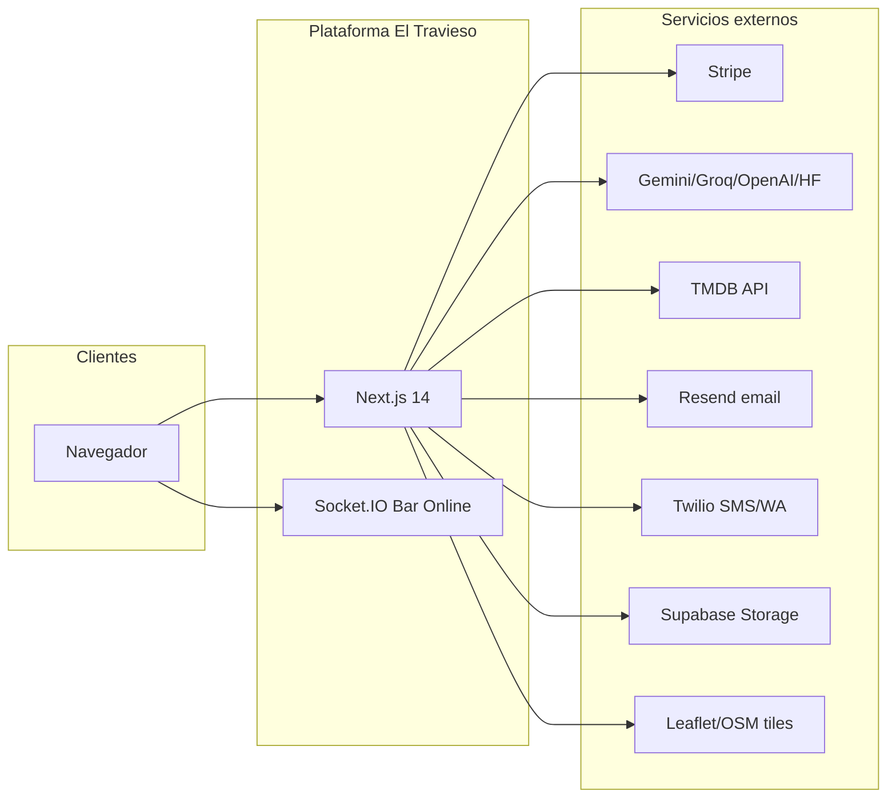
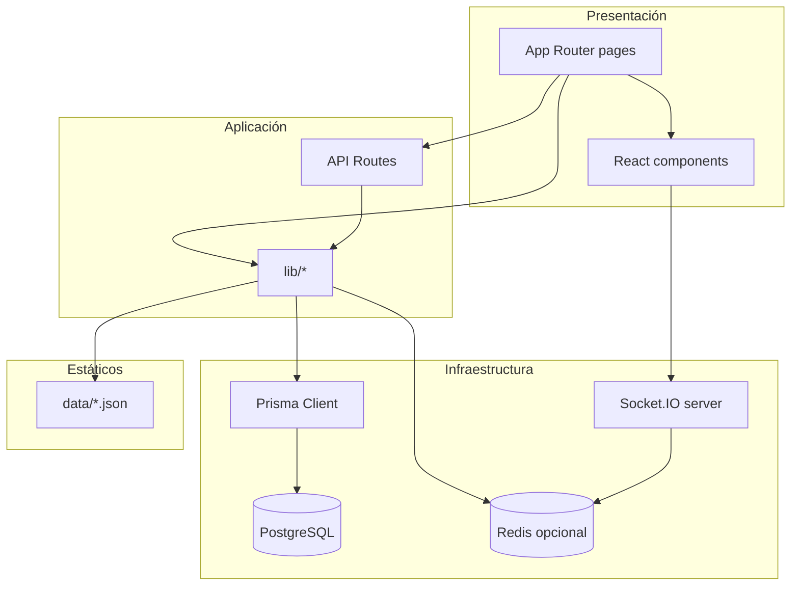
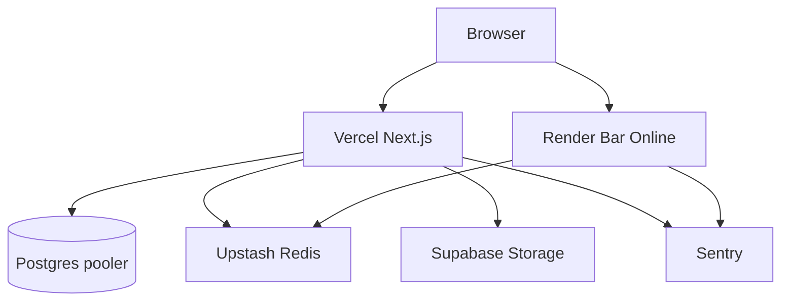
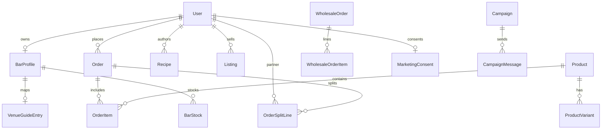
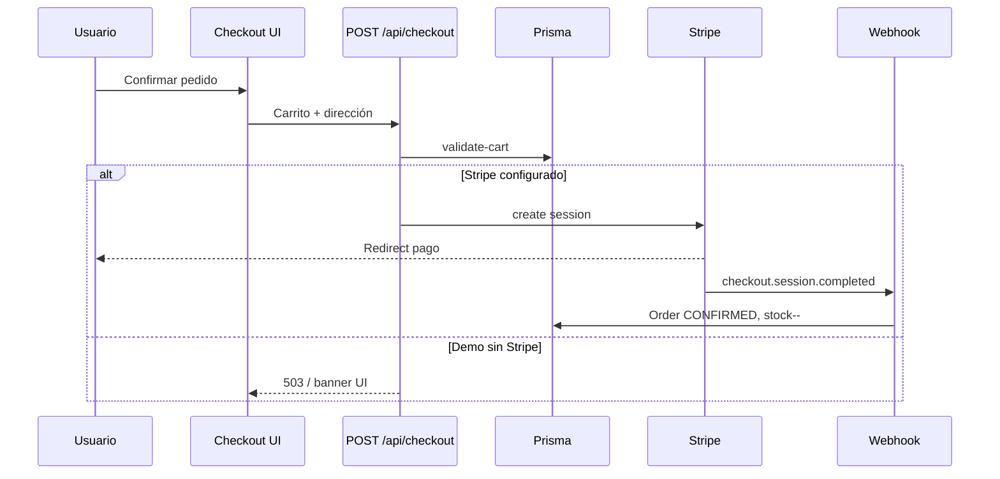

# Auditoría técnica — Vermut El Travieso (eltravieso)

**Versión del documento:** 1.0  
**Fecha de análisis:** 14 de junio de 2026  
**Alcance:** Repositorio `/eltravieso` (Next.js 14, Prisma, PostgreSQL)  
**Metodología:** Revisión estática del código, esquema Prisma, rutas App Router, APIs, configuración de despliegue y documentación existente (`AGENTS.md`, módulos en `docs/`). No incluye pentesting ni mediciones de Lighthouse en producción salvo donde se indique explícitamente.

**Leyenda de confianza**

| Nivel | Significado |
|-------|-------------|
| **Alta** | Confirmado en código, configuración o esquema versionado |
| **Media** | Inferencia razonable a partir de convenciones y documentación interna |
| **Baja** | Hipótesis no verificada en runtime o dependiente de variables de entorno del despliegue |

**Hecho vs inferencia:** Las afirmaciones marcadas con *(hecho)* provienen del repositorio. Las marcadas con *(inferencia)* son deducciones del analista.

---

## 1. Resumen ejecutivo

### Descripción general del producto

**El Travieso** es una plataforma digital B2C/B2B en torno al vermut premium y la coctelería. Combina e-commerce, catálogo editorial de recetas, herramientas profesionales para bares (IA, mapa de locales, integraciones ERP/TPV), comunidad en tiempo real (Bar Online), hub de medios (Pantalla), club VIP con monetización Stripe, marketplace con reparto de comisiones y un panel de administración integral. *(hecho — `AGENTS.md`, `prisma/schema.prisma`)*

### Objetivo principal

Centralizar la relación marca–consumidor–profesional HORECA: descubrir, comprar, aprender, colaborar y operar (stock, mayorista, fiscal, campañas) desde un único producto web. *(inferencia — alineado con modelos `BarProfile`, `WholesaleOrder`, `OrderSplitLine`, módulos documentados)*

### Problema que resuelve

- Fragmentación entre tienda online, recetario, guía de bares y herramientas de gestión.
- Falta de canal propio para comunidad y contenido (podcasts, series, directos).
- Necesidad de cumplimiento (mayor de edad, fiscal licores, GDPR en marketing) en un solo stack. *(inferencia)*

### Público objetivo

| Segmento | Necesidad principal |
|----------|---------------------|
| Consumidor B2C | Comprar vermut/productos, recetas, biblioteca, blog |
| Aficionado / home bar | Recetas, Barra IA, Bar Online |
| Propietario de bar (`BAR_OWNER`) | Mapa SaaS, stock, integraciones, eventos, mayorista |
| Mayorista (`WHOLESALER`) | Pedidos B2B, facturación |
| Administrador (`ADMIN`) | Catálogo, moderación, campañas, auditoría recetas |
| Partner marketplace | Listings, comisiones vía `OrderSplitLine` |

*(hecho — enum `UserRole` en Prisma)*

### Principales capacidades

- Shop B2C con carrito y checkout Stripe (modo demo sin claves).
- Catálogo de ~cocktails en JSON + Prisma; fichas `/recetas/[slug]`.
- Agente IA generador de recetas (`/pro/tech-generator`).
- Mapa de locales (`/mapa`) con datos World's 50 Best + fichas `/locales/[slug]`.
- Bar Online (Socket.IO independiente, puerto 3001).
- Pantalla: películas/series (TMDB), podcasts RSS, directo curado.
- Membresía VIP, drops mensuales, billing mapa para bares.
- Admin: productos, marketplace, mayorista, producción, recetas, auditoría Difford's, blog, campañas, reparto, fiscal, foro, pantalla, VIP drops.
- Marketing multicanal (email/SMS/WhatsApp) con consentimiento GDPR.
- Integraciones opcionales: Shopify, Holded, Square, webhooks TPV.

---

## 2. Visión general del sistema

### Descripción global

Monolito **Next.js 14 App Router** (frontend + API Routes) con **PostgreSQL** vía **Prisma**, autenticación **NextAuth** (credentials + adapter Prisma, sesiones JWT de 24 h), y un **servidor Socket.IO** separado para realtime. Datos estáticos complementarios en `data/*.json` (cocktails, products, books, venues). *(hecho)*

### Alcance

| Incluido | Excluido / periférico |
|----------|------------------------|
| Web app + APIs en Vercel | App móvil nativa |
| Bar Online WS en Render | Supabase Auth (explícitamente no usado) |
| Storage REST Supabase (imágenes/vídeo) | Supabase como BD principal |
| Scripts CLI de mantenimiento (`scripts/`) | Pipelines CI completos no auditados aquí |

### Contexto de uso

- **Desarrollo:** Docker Postgres `:5432`, opcional Redis, `npm run dev` + `npm run dev:ws`.
- **Demo local:** `AI_MOCK`, `MARKETING_MOCK`, checkout/VIP deshabilitados sin Stripe; usuario `demo@eltravieso.bar` *(hecho — trabajo reciente en conversación y `scripts/seed-demo.ts`)*.
- **Producción objetivo:** Vercel + Render + Upstash Redis + pooler Postgres + Sentry *(hecho — `docs/ESCALADO.md`)*.

### Ecosistema donde opera



### Dependencias externas

| Dependencia | Uso | Confianza |
|-------------|-----|-----------|
| PostgreSQL | Persistencia principal | Alta |
| Redis (opcional) | Rate limit, presencia Bar Online multi-instancia | Alta |
| Stripe | Checkout B2C, VIP, planes mapa | Alta |
| NextAuth | Login, JWT, 2FA | Alta |
| Supabase Storage REST | Upload media/blog/eventos | Alta |
| TMDB | Import series/películas Pantalla | Alta |
| Proveedores IA | Agente recetas | Alta |
| Resend / Twilio | Campañas marketing | Alta *(docs)* |
| Sentry | Observabilidad | Alta |
| World's 50 Best / Difford's | Scraping editorial | Media *(scripts)* |

---

## 3. Arquitectura general

### Arquitectura identificada

**Patrón:** Aplicación web monolítica modular (Next.js) + **microservicio ligero** para WebSockets + **base de datos relacional** + **JSON estático** como capa de catálogo/seed.

No hay microservicios por dominio de negocio; la lógica vive en `app/api/*` y `lib/*`. *(hecho)*

### Componentes principales

| Componente | Ubicación | Responsabilidad |
|------------|-----------|-----------------|
| UI pública y cuenta | `app/**/page.tsx` | SSR/RSC, navegación |
| Panel admin | `app/admin/**` | Gestión operativa |
| API REST | `app/api/**/route.ts` (86 rutas) | Mutaciones y consultas |
| Dominio | `lib/**` | Auth, checkout, IA, venues, marketing… |
| Datos | `prisma/schema.prisma` | 39 modelos |
| Realtime | `server/realtime/index.ts` | Salas Bar Online |
| Cliente WS | `lib/realtime/useBarOnline.ts` | Hook React |
| Componentes UI | `components/**` | Header, forms, admin… |

### Relación entre componentes



### Flujo general de información

1. Usuario accede a página Next.js (RSC o client component).
2. Datos de lectura: Prisma, JSON local, o fetch a API interna.
3. Acciones: `fetch('/api/...')` o Server Actions limitadas; mutaciones sensibles vía API con sesión.
4. Checkout: API valida carrito contra Prisma → Stripe Session → webhook confirma pedido.
5. Bar Online: cliente Socket.IO → servidor Render → presencia en Redis si configurado.
6. IA: POST `/api/ai/agent` → provider chain → persistencia `Recipe` en Prisma.

### Diagrama de despliegue (objetivo producción)

Ver `docs/ESCALADO.md`. Resumen:



---

## 4. Análisis funcional completo

### 4.1 Mapa de módulos

| Módulo | Rutas UI principales | API / lib clave |
|--------|----------------------|-----------------|
| Shop / checkout | `/shop`, `/shop/[slug]`, `/cart`, `/checkout` | `app/api/checkout`, `lib/checkout/` |
| Recetas | `/recetas`, `/recetas/[slug]` | `data/cocktails.json`, Prisma `Recipe` |
| Barra IA | `/pro/tech-generator` | `app/api/ai/agent`, `lib/ai/` |
| Biblioteca | `/biblioteca`, `/biblioteca/[slug]` | `data/books.json`, `lib/books/` |
| Alcoholes | `/alcoholes` | `app/api/alcoholes` |
| Blog | `/blog`, `/blog/[slug]` | `app/api/blog`, Prisma `BlogPost` |
| Mapa / locales | `/mapa`, `/locales/[slug]` | `app/api/venues/guide`, `VenueGuideEntry` |
| Pantalla | `/pantalla`, `/pantalla/[slug]`, `/pantalla/directo` | `app/api/media`, admin media |
| Bar Online | `/bar-online`, `/bar-online/[roomId]` | `app/api/bar-online`, WS server |
| Comunidad / foro | `/comunidad`, `/comunidad/[slug]` | `app/api/forum` |
| Cuenta usuario | `/cuenta/*` | `app/api/user/*` |
| Membresía VIP | `/cuenta/membresia` | `app/api/billing/vip`, Stripe |
| Bar profesional | `/cuenta/bar`, eventos | `app/api/user/bar`, `app/api/bar/*` |
| Marketplace vendedor | `/cuenta/marketplace` | `app/api/marketplace/listings` |
| Integraciones | `/cuenta/integraciones` | Shopify/Holded/Square APIs |
| Admin | `/admin/**` | `app/api/admin/**`, `requireAdminUser` |
| Marketing | `/marketing/unsubscribe` | `app/api/marketing/unsubscribe`, campañas admin |
| Legal | `/aviso-legal`, `/politica-privacidad`, `/terminos-y-condiciones` | Estáticas |
| Auth | `/login`, `/register`, `/setup-2fa` | NextAuth, `app/api/auth/*` |

### 4.2 Funcionalidades detalladas (muestra representativa)

Para cada bloque: **Nombre | Objetivo | Flujo | Entradas | Salidas | Dependencias**

#### F1 — Shop B2C

| Campo | Detalle |
|-------|---------|
| **Objetivo** | Venta de productos propios, marketplace y afiliados |
| **Flujo** | Listado → ficha → añadir al carrito (contexto cliente) → `/cart` → `/checkout` → Stripe o modo demo |
| **Entradas** | `Product`/`ProductVariant` (Prisma + `data/products.json` seed), carrito en cliente |
| **Salidas** | `Order` PENDING → CONFIRMED vía webhook; emails *(inferencia)* |
| **Dependencias** | Stripe, Prisma, `lib/checkout/validate-cart.ts` |
| **Reglas** | Precios validados server-side; importes en céntimos; stock en variantes |
| **Validaciones** | Carrito no vacío; Stripe configurado o 503 en demo *(hecho — checkout route)* |
| **Confianza** | Alta |

#### F2 — Agente IA (Barra Inteligente)

| Campo | Detalle |
|-------|---------|
| **Objetivo** | Generar recetas estructuradas desde prompt natural |
| **Flujo** | Usuario escribe prompt → POST `/api/ai/agent` → búsqueda similar → LLM → validación → persistencia `Recipe` |
| **Entradas** | `{ prompt \| text \| comment }`, sesión opcional |
| **Salidas** | JSON receta; registro en BD; visible en `/recetas` |
| **Dependencias** | `lib/ai/provider.ts`, rate limit, `AI_MOCK` para demo |
| **Reglas** | Rate limit configurable; fallback gemini→groq→openai→huggingface |
| **Confianza** | Alta |

#### F3 — Mapa de locales (guía)

| Campo | Detalle |
|-------|---------|
| **Objetivo** | Descubrir bares/restaurantes destacados (World's 50 Best + manual) |
| **Flujo** | Mapa Leaflet → clusters → ficha `/locales/[slug]` |
| **Entradas** | `VenueGuideEntry`, geocodificación opcional |
| **Salidas** | HTML SEO, enlaces reserva/TripAdvisor |
| **Dependencias** | `npm run scrape:venues`, `seed:venues`, `geocode:venues` |
| **Confianza** | Alta |

#### F4 — Bar Online

| Campo | Detalle |
|-------|---------|
| **Objetivo** | Salas chat/videollamada/cata entre profesionales |
| **Flujo** | Lobby → crear/unirse sala → Socket.IO → presencia |
| **Entradas** | `BarOnlineSession`, JWT/sesión, `NEXT_PUBLIC_WS_URL` |
| **Salidas** | Eventos realtime; registro sesión en Prisma |
| **Reglas** | VIP amplía límite usuarios (`VIP_MAX_ROOM_USERS`, `FREE_MAX_ROOM_USERS`) *(hecho — AGENTS.md)* |
| **Confianza** | Alta |

#### F5 — Membresía VIP y drops

| Campo | Detalle |
|-------|---------|
| **Objetivo** | Suscripción ~15€/mes, beneficios Bar Online, drop mensual producto |
| **Flujo** | `/cuenta/membresia` → Stripe Checkout → webhook actualiza `membershipStatus` → admin configura `VipMonthlyDrop` → fulfillment |
| **Entradas** | Stripe price IDs, dirección usuario |
| **Salidas** | `MembershipDropFulfillment`, pedido automático *(inferencia)* |
| **Confianza** | Alta en modelo; Media en automatización completa |

#### F6 — Marketplace split

| Campo | Detalle |
|-------|---------|
| **Objetivo** | Terceros venden; plataforma retiene comisión (`commissionRateBps`, `OrderSplitLine`) |
| **Flujo** | Listing PENDING → admin aprueba → Product generado → venta → split lines |
| **Reglas** | Checkout marketplace exige login *(AGENTS.md)* |
| **Confianza** | Alta |

#### F7 — Mayorista B2B

| Campo | Detalle |
|-------|---------|
| **Objetivo** | Pedidos por palet/caja, estados DRAFT→PAID, facturas |
| **Flujo** | Admin `/admin/wholesale` + perfil bar |
| **Modelos** | `WholesaleOrder`, `WholesaleInvoice`, `ProductVariant.wholesaleCents` |
| **Confianza** | Alta |

#### F8 — Campañas marketing

| Campo | Detalle |
|-------|---------|
| **Objetivo** | Email/SMS/WhatsApp con consentimiento |
| **Flujo** | Admin crea campaña → preview → send → `CampaignMessage` por destinatario |
| **Dependencias** | Resend, Twilio; `MARKETING_MOCK` en demo |
| **Reglas** | Unsubscribe firmado (`MARKETING_UNSUBSCRIBE_SECRET`) |
| **Confianza** | Alta |

#### F9 — Auditoría recetas Difford's

| Campo | Detalle |
|-------|---------|
| **Objetivo** | Comparar catálogo con fuente externa y aplicar correcciones |
| **Flujo** | CLI o `/admin/recetas-auditoria` → fetch throttled → diff → apply |
| **Confianza** | Alta *(docs/AUDITORIA-RECETAS.md)* |

#### F10 — Integraciones HORECA

| Campo | Detalle |
|-------|---------|
| **Objetivo** | Sync stock/pedidos Shopify, Holded, Square; webhook TPV |
| **Flujo** | OAuth/sync desde `/cuenta/integraciones` |
| **Estado demo** | UI con banner; botones deshabilitados *(hecho — cambios recientes)* |
| **Confianza** | Alta |

### 4.3 Procesos automáticos

| Proceso | Trigger | Confianza |
|---------|---------|-----------|
| Stripe webhooks | Eventos pago/suscripción | Alta |
| Cron sync podcasts | `app/api/cron/sync-podcasts` | Alta |
| VIP drop process | Admin API `/admin/vip-drops/.../process` | Alta |
| Holded/Shopify webhooks | Push stock | Alta |
| Seed/migraciones | CLI `db:setup` | Alta |
| Geocodificación venues | CLI `geocode:venues` | Alta |

### 4.4 Restricciones globales

- Edad: `AgeGateModal` + `ageVerifiedAt` en usuario *(hecho — layout)*.
- Admin: rol `ADMIN` + 2FA si `ADMIN_REQUIRE_2FA=true` *(hecho — `middleware.ts`)*.
- Monetarios: enteros en céntimos, sin floats en schema *(hecho — comentario schema)*.
- Auth: solo credentials; no Supabase Auth *(hecho — reglas proyecto)*.

---

## 5. Análisis de navegación y UX

### Mapa de navegación (header público)

Definido en `lib/navigation/groups.ts` *(hecho)*:

```mermaid
flowchart TD
  Home[/]
  Home --> Discover[Descubrir]
  Home --> Pro[Pro]
  Home --> Community[Comunidad]
  Discover --> R[/recetas]
  Discover --> A[/alcoholes]
  Discover --> B[/biblioteca]
  Discover --> S[/shop]
  Discover --> Bl[/blog]
  Pro --> IA[/pro/tech-generator]
  Pro --> M[/mapa]
  Pro --> P[/pantalla]
  Community --> BO[/bar-online]
  Community --> C[/comunidad]
  Home --> Cart[/cart]
  Home --> Account[/cuenta o /login]
```

### Jerarquía de páginas (67 rutas `page.tsx` detectadas)

| Área | Rutas |
|------|-------|
| Público raíz | `/`, legal ×3 |
| Catálogo | shop, recetas, biblioteca, alcoholes, blog, pantalla, mapa, locales |
| Pro | `/pro`, `/pro/tech-generator` |
| Comunidad | `/comunidad`, foro por slug |
| Comercio | `/cart`, `/checkout` |
| Auth | `/login`, `/register`, `/setup-2fa` |
| Cuenta | `/cuenta`, configuración, seguridad, recetas, blog, bar, eventos, marketplace, integraciones, membresía |
| Bar Online | lobby + `[roomId]` |
| Admin | 25+ rutas bajo `/admin` |
| Marketing | `/marketing/unsubscribe` |

### Menús

- **Header desktop:** 3 dropdowns (Descubrir, Pro, Comunidad) + carrito + cuenta/login.
- **Header móvil:** overlay full-screen con mismos grupos.
- **Admin sidebar:** 15 enlaces fijos en `app/admin/layout.tsx`.
- **Cuenta:** enlaces contextuales en overview + rutas dedicadas *(inferencia — patrón estándar)*.

### Flujos de usuario clave

| Flujo | Entrada | Salida |
|-------|---------|--------|
| Compra guest | Shop → cart → checkout | Stripe o bloqueo demo |
| Crear receta IA | Login opcional → tech-generator | `/recetas/[slug]` |
| Unirse Bar Online | `/bar-online` → sala | WS desconecta al salir |
| Alta bar mapa | Cuenta bar → plan Stripe | `mapPlan` FEATURED/BOOKING_PLUS |
| Admin campaña | `/admin/campaigns/new` | Envío multicanal |

### UX observada *(hecho — componentes)*

- Tema oscuro global (`dark`, paleta marca en `docs/DISENO-MARCA.md`).
- Tipografías Montserrat + Playfair Display.
- Animaciones Framer Motion en header y menú móvil.
- Banner amarillo dev si falta BD/WS (`DevEnvironmentBanner`).
- Age gate y banner cookies en primera visita.
- Modo demo explícito en checkout, VIP e integraciones.

---

## 6. Análisis de interfaz

Inventario por **áreas funcionales** (no exhaustive cell-by-cell de 67 pantallas; cada fila resume objetivo, elementos y estados). Confianza **Alta** salvo anotación.

### 6.1 Público — Home `/`

| Atributo | Detalle |
|----------|---------|
| **Objetivo** | Landing marca, acceso a módulos |
| **Elementos** | Hero, CTAs a shop/recetas/pro, posible motion/scroll (Lenis) |
| **Acciones** | Navegar vía header |
| **Estados** | Scroll sticky header |

### 6.2 Shop `/shop`, `/shop/[slug]`

| Atributo | Detalle |
|----------|---------|
| **Objetivo** | Catálogo y ficha producto |
| **Elementos** | Grid productos, filtros categoría, precio, stock, galería |
| **Formularios** | Selector cantidad/formato |
| **Acciones** | Añadir al carrito |
| **Estados** | Agotado, afiliado (enlace externo), marketplace |

### 6.3 Carrito y checkout `/cart`, `/checkout`

| Atributo | Detalle |
|----------|---------|
| **Elementos** | Lista líneas, subtotal, formulario envío |
| **Botones** | Pagar (Stripe Elements) / deshabilitado si demo |
| **Estados** | Banner demo sin `STRIPE_SECRET_KEY` |

### 6.4 Recetas `/recetas`, `/recetas/[slug]`

| Atributo | Detalle |
|----------|---------|
| **Elementos** | Listado filtrable, ficha ingredientes/pasos/vaso |
| **Acciones** | Favoritos *(si implementado en API)*, enlaces biblioteca |

### 6.5 Barra IA `/pro/tech-generator`

| Atributo | Detalle |
|----------|---------|
| **Formularios** | Textarea prompt, tabs agente/búsqueda |
| **Acciones** | Generar, ver estado IA |
| **Estados** | Loading, error rate limit, mock response |

### 6.6 Mapa `/mapa`, ficha `/locales/[slug]`

| Atributo | Detalle |
|----------|---------|
| **Elementos** | Mapa Leaflet, marcadores, panel ficha |
| **Acciones** | Filtrar región, enlace reserva |

### 6.7 Pantalla `/pantalla/**`

| Atributo | Detalle |
|----------|---------|
| **Elementos** | Grid media, reproductores embed, directo |
| **Estados** | DRAFT/PUBLISHED según rol |

### 6.8 Bar Online `/bar-online`, `/bar-online/[roomId]`

| Atributo | Detalle |
|----------|---------|
| **Elementos** | Lista salas, chat/video UI, indicador conexión WS |
| **Estados** | Desconectado, reconectando, sala llena |

### 6.9 Auth `/login`, `/register`, `/setup-2fa`

| Atributo | Detalle |
|----------|---------|
| **Formularios** | Email/password; TOTP en login si 2FA; QR en setup |
| **Estados** | Error credenciales, redirect `callbackUrl`, flag admin |

### 6.10 Cuenta `/cuenta/**`

| Pantalla | Elementos principales |
|----------|----------------------|
| Overview | Stats recetas, 2FA, accesos rápidos |
| Configuración | Perfil, dirección, cumpleaños |
| Seguridad | Cambio password, activar 2FA |
| Membresía | Plan VIP, portal Stripe, banner demo |
| Bar | Perfil negocio, plan mapa, stock |
| Integraciones | Tarjetas Shopify/Holded/Square, sync deshabilitado demo |
| Marketplace | CRUD listings vendedor |

### 6.11 Admin `/admin/**`

| Pantalla | Tablas/formularios típicos |
|----------|----------------------------|
| Dashboard | KPIs resumen |
| Products | Tabla productos, edición variantes |
| Marketplace | Aprobar/rechazar listings |
| Wholesale | Pedidos B2B, estados |
| Production | Lotes `ProductionBatch` |
| Recipes | CRUD recetas Prisma |
| Recetas auditoría | Diff diff, apply |
| Pantalla | TMDB search, import, feeds podcast |
| Campaigns | Editor, preview, send |
| VIP drops | Mes, producto, fulfillments |
| Delivery | Rutas reparto |
| Tax registry | Registro fiscal licores |
| Forum | Moderación topics |
| Posts | Editor TipTap blog |

Sidebar fijo + logout en footer admin layout.

---

## 7. Modelo de datos

### Entidades principales (39 modelos Prisma)

Agrupadas por dominio *(hecho — grep schema)*:

| Dominio | Modelos |
|---------|---------|
| Auth | User, Account, Session, VerificationToken |
| Catálogo | Product, ProductVariant, Listing |
| B2C | Order, OrderItem, OrderSplitLine, VipMonthlyDrop, MembershipDropFulfillment |
| HORECA | BarProfile, BarStock, VenueGuideEntry |
| B2B | WholesaleOrder, WholesaleOrderItem, WholesaleInvoice |
| Producción / logística | ProductionBatch, DeliveryRoute, DeliveryStop, LiquorsTaxRegistry |
| Contenido | Recipe, TechnicalSheet, BlogPost |
| Comunidad | ForumTopic, ForumComment |
| Realtime | BarOnlineSession |
| Marketing | MarketingConsent, Campaign, CampaignMessage |
| Media | MediaItem, PodcastFeed, LiveStream, MediaComment, MediaRating |
| Infra | ProcessedWebhook |

### Diagrama ER ( núcleo comercial )



### Campos y restricciones relevantes

| Entidad | Campos clave | Restricciones |
|---------|--------------|---------------|
| User | email unique, role, membershipStatus, 2FA | password hasheado bcrypt |
| Product | slug unique, source, commissionRateBps | enums category/type/channel |
| ProductVariant | sku unique, priceCents, stock | minOrderQty default 1 |
| Order | orderNumber unique, totalCents | status enum |
| BarProfile | taxId unique, mapPlan | tokens integración en Text |
| VenueGuideEntry | sourceUrl unique, slug unique | worlds50bestRank |
| Listing | status workflow | PENDING→APPROVED |

### Datos estáticos JSON

| Archivo | Uso |
|---------|-----|
| `data/cocktails.json` | Catálogo recetas base |
| `data/products.json` | Seed productos |
| `data/books.json` | Biblioteca |
| `data/venues-worlds50best.json` | Pipeline mapa |

Confianza: **Alta**.

---

## 8. APIs e integraciones

### 8.1 APIs internas (86 route handlers)

Agrupación por prefijo:

| Prefijo | Métodos típicos | Propósito |
|---------|-----------------|-----------|
| `/api/auth/*` | GET, POST | NextAuth, register, 2FA setup |
| `/api/user/*` | GET, PATCH | Perfil, password, recetas, bar, avatar |
| `/api/checkout` | POST | Crear sesión Stripe |
| `/api/stripe/webhook` | POST | Confirmar pagos/suscripciones |
| `/api/billing/vip`, `/map-plan`, `/portal` | POST | Monetización |
| `/api/ai/agent`, `/status` | GET, POST | IA recetas |
| `/api/recipes/search` | GET | Búsqueda |
| `/api/marketplace/*` | CRUD | Listings, ventas partner |
| `/api/admin/*` | CRUD | Panel admin |
| `/api/media/*` | GET, POST | Hub pantalla, uploads |
| `/api/forum/*` | CRUD | Foro |
| `/api/bar-online` | GET, POST | Sesiones salas |
| `/api/integrations/*` | POST | Sync OAuth webhooks |
| `/api/tpv/webhook` | POST | TPV entrada |
| `/api/marketing/unsubscribe` | GET | Baja GDPR |
| `/api/cron/sync-podcasts` | GET | Cron podcasts |
| `/api/dev/health` | GET | Health dev |
| `/api/venues/guide` | GET | Datos mapa |
| `/api/alcoholes` | GET | Catálogo alcoholes |

Protección admin: `lib/auth/admin-api.ts` → `requireAdminUser`. *(hecho)*

### 8.2 APIs externas

| Servicio | Endpoint / SDK | Flujo |
|----------|----------------|-------|
| Stripe | REST + webhooks | Checkout, VIP, map plans |
| Google Gemini / Groq / OpenAI / HF | HTTPS | Texto/imagen IA |
| TMDB | `api.themoviedb.org` | Import media admin |
| Supabase | Storage REST | Upload imágenes/vídeo |
| Resend | Email API | Campañas EMAIL |
| Twilio | SMS/WhatsApp | Campañas |
| Difford's | Scrape HTTP | Auditoría recetas |
| OSM/Leaflet tiles | Tiles mapa | *(inferencia — leaflet)* |

### 8.3 Flujo checkout (diagrama)



---

## 9. Tecnologías utilizadas

| Tecnología | Rol | Confianza |
|------------|-----|-----------|
| Next.js 14.2.5 | Framework full-stack | Alta |
| React 18.3 | UI | Alta |
| TypeScript 5.6 | Tipado | Alta |
| Tailwind CSS 3.4 | Estilos | Alta |
| Prisma 5.15 | ORM | Alta |
| PostgreSQL | BD | Alta |
| NextAuth 4.24 | Auth | Alta |
| bcryptjs | Hash passwords | Alta |
| otplib + qrcode | 2FA TOTP | Alta |
| Stripe 12.x | Pagos | Alta |
| Socket.IO 4.8 | Realtime | Alta |
| ioredis | Redis client | Alta |
| Leaflet / react-leaflet | Mapas | Alta |
| Framer Motion 11 | Animaciones | Alta |
| TipTap | Editor blog admin | Alta |
| @google/genai, openai | IA | Alta |
| @sentry/nextjs | Errores | Alta |
| Vitest 3 | Tests | Alta |
| Remotion 4 | Vídeos recetas (CLI) | Alta |
| Vercel | Hosting Next *(docs)* | Media |
| Render | Hosting WS *(render.yaml)* | Alta |
| Upstash Redis | Rate limit/presencia *(docs)* | Media |
| Supabase Storage | Media *(lib/storage)* | Alta |
| shadcn/radix-ui | Componentes UI | Alta |
| embedded-postgres | Dev sin Docker | Alta |

No se detectaron `robots.txt` ni `sitemap.xml` en App Router *(hecho — búsqueda vacía)*. Confianza SEO: **Alta** para ausencia en repo.

---

## 10. Seguridad

### Autenticación *(hecho — lib/auth.ts)*

- Provider **Credentials** único; email normalizado a minúsculas.
- Contraseñas con **bcrypt**.
- **2FA TOTP** opcional; obligatorio admin si `ADMIN_REQUIRE_2FA=true`.
- Sesión **JWT** 24 h; adapter Prisma para cuentas/sessions DB.

### Autorización

- Admin: middleware en `/admin/*` + layout server-side `evaluateAdminAccess`.
- APIs admin: `requireAdminUser`.
- Roles: USER, ADMIN, BAR_OWNER, WHOLESALER.
- VIP flag en JWT (`isVip`) para salas Bar Online.

### Gestión de sesiones

- Cookie `httpOnly`, `sameSite: lax`, `secure` en producción.
- Nombre cookie `__Secure-` en prod.

### Protección de datos

- CSP y security headers en `next.config.mjs` *(hecho)*.
- `logServerError` + redacción tokens (`lib/security/redact.ts`) *(AGENTS.md)*.
- Importes y PII en JSON shipping/billing en Order.

### Buenas prácticas observadas

- ESLint no ignorado en build.
- Webhook Stripe con firma (`STRIPE_WEBHOOK_SECRET`).
- Rate limiting en IA y otros endpoints.
- `ProcessedWebhook` idempotencia *(modelo)*.
- Pre-commit anti-secretos documentado.

### Riesgos detectados

| Riesgo | Severidad | Confianza |
|--------|-----------|-----------|
| CSP permite `'unsafe-inline'` y `'unsafe-eval'` | Media | Alta |
| Tokens integración en `BarProfile` (Text) — exfiltración si SQLi | Alta | Media |
| JWT strategy sin rotación frecuente | Baja | Media |
| Rate limit in-memory sin Redis en dev/single instance | Media | Alta |
| frame-src `https:` amplio en CSP | Media | Alta |
| Credenciales demo en seed (`demo1234`) — solo dev | Alta | Alta |

---

## 11. Rendimiento

### Evaluación *(mix hecho/inferencia)*

| Aspecto | Observación | Confianza |
|---------|-------------|-----------|
| Carga inicial | Fuentes Google con `display: swap`; dark theme global | Alta |
| Bundle | Next 14 App Router; muchos client components en rutas interactivas | Media |
| Imágenes | `next/image` + remotePatterns configurados | Alta |
| BD | Índices en slug, email, status; pooler recomendado en prod | Alta |
| Caché | Sin `unstable_cache` global evidente; RSC `force-dynamic` en admin/cuenta | Alta |
| Realtime | WS separado evita bloquear serverless Next | Alta |
| Cuellos de botella | Scraping Difford's; IA síncrona; mapa con muchos marcadores | Media |
| JSON cocktails grande | Lectura filesystem en generación | Media |

### Recomendaciones rendimiento

Ver sección 15.

---

## 12. SEO y accesibilidad

### SEO técnico

| Elemento | Estado | Confianza |
|----------|--------|-----------|
| `lang="es"` en html | Presente | Alta |
| Metadata root title/description | Básica en layout | Alta |
| Open Graph / Twitter cards globales | No visto en root layout | Alta (ausencia) |
| robots.txt / sitemap | No en repo | Alta |
| Rutas semánticas `/recetas/[slug]` | Sí | Alta |
| Fichas locales SEO | Documentado GUIA-LOCALES | Alta |

### Accesibilidad

| Elemento | Estado | Confianza |
|----------|--------|-----------|
| aria-label carrito y menú móvil | Presente en Header | Alta |
| Contraste tema oscuro | Paleta marca documentada | Media |
| Age gate modal | Puede afectar foco teclado | Media |
| Mapa Leaflet | Requiere alternativa textual en fichas | Media |
| Auditoría WCAG automatizada | No ejecutada en este informe | Alta |

---

## 13. Flujo detallado de procesos

### 13.1 Registro

```mermaid
flowchart TD
  A[/register] --> B[POST /api/auth/register]
  B --> C{Validación email/password}
  C -->|OK| D[User creado bcrypt]
  C -->|Error| E[Mensaje UI]
  D --> F[Redirect login]
```

Entradas: email, password, datos opcionales. Salida: usuario `USER` por defecto.

### 13.2 Inicio de sesión

```mermaid
flowchart TD
  A[/login] --> B[NextAuth Credentials]
  B --> C{Password OK?}
  C -->|No| D[Error]
  C -->|Sí| E{2FA enabled?}
  E -->|Sí| F[token2fa]
  F --> G{ válido?}
  G -->|No| D
  G -->|Sí| H[JWT + cookie]
  E -->|No| H
  H --> I[callbackUrl o /cuenta]
```

Admin: middleware exige rol + 2FA verificado en token.

### 13.3 Checkout B2C

1. Usuario acumula carrito (contexto React).
2. `/checkout` muestra resumen + dirección.
3. POST `/api/checkout` valida precios/stock desde Prisma.
4. Si Stripe OK → redirect; webhook confirma y crea split lines marketplace.
5. Si demo → 503 y UI deshabilitada.

### 13.4 Generación receta IA

1. POST `/api/ai/agent` con prompt.
2. Rate limit por IP/usuario.
3. Búsqueda `/api/recipes/search` o cocktails.json.
4. LLM estructura JSON; reparación ingredientes si vacío.
5. Persistencia `Recipe` con autor sesión o sistema.
6. Respuesta a UI con slug.

### 13.5 Bar Online

1. GET/POST `/api/bar-online` lista/crea `BarOnlineSession`.
2. Cliente conecta a `NEXT_PUBLIC_WS_URL`.
3. Eventos join/leave/message; Redis sync multi-instancia.
4. VIP aumenta capacidad sala.

### 13.6 Campaña marketing

1. Admin crea `Campaign` DRAFT.
2. Preview API.
3. Send: iteración consentimientos `MarketingConsent`.
4. Registro `CampaignMessage`; mock si `MARKETING_MOCK`.

---

## 14. Riesgos y deuda técnica

| ID | Problema | Impacto | Confianza |
|----|----------|---------|-----------|
| R1 | Dual fuente recetas JSON + Prisma — sincronización manual | Inconsistencias catálogo | Alta |
| R2 | 86 APIs sin OpenAPI centralizado | Mantenimiento, onboarding | Alta |
| R3 | Integraciones con secretos en BarProfile | Superficie de ataque | Media |
| R4 | WS + Next desplegados separados — CORS/env drift | Bar Online roto en prod | Alta |
| R5 | Migraciones recientes corregidas manualmente | Riesgo en fresh deploy | Media *(contexto conversación)* |
| R6 | Admin pages borradas accidentalmente en git status previo | Pérdida funcionalidad | Alta *(mitigado restore)* |
| R7 | Sin sitemap/robots | SEO indexación subóptima | Alta |
| R8 | Muchas rutas `force-dynamic` | TTFB en Vercel | Media |
| R9 | Dependencia scrape externo Difford's/50 Best | Rotura por cambios HTML | Media |
| R10 | Marketplace Connect Stripe fase 2 incompleta *(AGENTS.md)* | Pagos partner manual | Media |

---

## 15. Recomendaciones de mejora

### Alta prioridad

1. **Publicar `app/robots.ts` y `app/sitemap.ts`** — Mejora indexación de recetas, locales y shop. *Justificación:* ausencia confirmada en repo.
2. **Documentar OpenAPI o tabla viva de APIs** — Reduce errores integración frontend/admin. *Justificación:* 86 rutas sin contrato único.
3. **Cifrar o externalizar tokens TPV/Shopify en BarProfile** — Vault o columnas cifradas a nivel app. *Justificación:* campos sensibles en texto plano.
4. **Endurecer CSP** — Eliminar `unsafe-eval`; restringir `frame-src`. *Justificación:* headers actuales permisivos.
5. **CI obligatorio test+build+smoke** — Ya existen scripts; formalizar en pipeline Git. *Justificación:* regresiones admin demostradas.

### Media prioridad

6. **Cache selectivo RSC** para catálogos públicos (recetas, biblioteca, shop listing).
7. **Metadata OG por ruta** (`generateMetadata` en slugs).
8. **Unificar catálogo recetas** — Estrategia single source: Prisma o JSON con sync job.
9. **Auditoría a11y automatizada** (axe) en rutas críticas checkout/login.
10. **Pooler Prisma** `directUrl` en producción según ESCALADO.md.

### Baja prioridad

11. **Storybook** para componentes marca (`BrandButton`, cards).
12. **GraphQL BFF** solo si proliferan clientes móviles.
13. **Internacionalización i18n** — Hoy contenido ES-first.
14. **PWA offline** para recetas favoritas.

---

## 16. Conclusión

### Estado general del sistema

El Travieso es una **plataforma madura en alcance funcional**, con dominios bien delimitados en Prisma y documentación modular en `docs/`. El código sigue convenciones Next.js 14 coherentes (App Router, API routes, lib compartida). El entorno demo reciente permite presentaciones sin Stripe ni integraciones externas. *(hecho — verificación test/build/smoke en conversación previa)*

### Madurez técnica

| Dimensión | Valoración (1–5) | Notas |
|-----------|------------------|-------|
| Arquitectura | 4 | Separación WS acertada; monolito API manejable |
| Seguridad | 3.5 | 2FA, headers, webhooks; CSP y secretos mejorables |
| Tests | 4 | Vitest + smoke E2E ampliado |
| Documentación dev | 4 | AGENTS.md + docs módulo; falta contrato API |
| Operaciones | 3.5 | ESCALADO claro; multi-servicio afinar |
| UX/producto | 4 | Navegación clara, modo demo explícito |

### Escalabilidad

Horizontal en **Bar Online** vía Redis; **Next.js** escala en Vercel con pooler Postgres. Cuellos: IA síncrona, scrapers, mapas densos. Confianza: **Media-Alta**.

### Mantenibilidad

Alta en módulos con docs dedicados; deuda en dual JSON/Prisma y superficie admin amplia. Convención `@/lib` y reglas Cursor mitigan dispersión.

### Calidad global

**Apto para producción controlada** con variables Stripe, Redis, WS y pooler configurados. Recomendable completar SEO, endurecer CSP y proteger tokens integración antes de escala comercial plena.

---

## Anexos

| Recurso | Ruta |
|---------|------|
| Memoria accesible | [MEMORIA-CODIGO.md](./MEMORIA-CODIGO.md) |
| Guía agentes | [../AGENTS.md](../AGENTS.md) |
| Escalado | [ESCALADO.md](./ESCALADO.md) |
| Schema roadmap | [SCHEMA_ROADMAP.md](./SCHEMA_ROADMAP.md) |
| Esquema BD | [../prisma/schema.prisma](../prisma/schema.prisma) |

---

*Documento generado por análisis estático del repositorio eltravieso. Para validación runtime en un entorno concreto, ejecutar `npm run check:local`, `npm run smoke` y revisión manual del flujo demo documentado en MEMORIA-CODIGO.md.*
