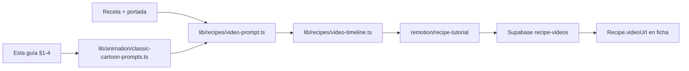

# Guía de Referencia para Animación Cartoon Clásica
*Inspiración en la estética animada de los años 60-80 aplicada al universo "El Travieso"*

Esta guía documenta los principios visuales, narrativos y técnicos de la animación 2D clásica de las décadas de 1960 a 1980, con un análisis específico de las dinámicas estilísticas de series como *Daniel el Travieso* (Dennis the Menace, producción de DIC Entertainment de 1986). A partir de esta deconstrucción, se proponen pautas de diseño y una biblioteca de prompts para generar contenido gráfico original libre de derechos de autor que encaje con la identidad de marca canalla y rebelde de **Vermut El Travieso**.

---

## 1. Análisis del Estilo de Animación Clásica (60s - 80s)

### Diseño de Personajes y Proporciones
*   **Geometría Orgánica Simplificada:** Los personajes se construyen a partir de formas básicas legibles (círculos para las cabezas, óvalos o peras invertidas para el torso). Esto facilita la consistencia en el dibujo manual fotograma a fotograma.
*   **Proporciones Exageradas:** Relación de cabeza-cuerpo de 1:3 o 1:4 para niños y personajes cómicos (cabezas grandes, extremidades expresivas y delgadas) frente a proporciones más estilizadas de 1:6 para los adultos serios o figuras de autoridad.
*   **Manos y Pies Simplificados:** Manos de cuatro dedos (estilo *mitten* o guante) muy dinámicas, dedos redondeados que se curvan sin articulaciones rígidas. Zapatos y pies diseñados como masas continuas que actúan como base pesada para equilibrar las poses exageradas.
*   **Línea de Acción Clara:** Siluetas extremadamente reconocibles. Si se pintase de negro la silueta del personaje, su acción o emoción debe seguir entendiéndose de inmediato (principio de legibilidad visual).

### Expresiones Faciales y Expresividad
*   **Ojos Grandes y Elásticos:** Los ojos ocupan una gran porción del rostro. Las pupilas se mueven de forma dinámica y la esclerótica (el blanco del ojo) se estira o se deforma para denotar sorpresa, picardía o enfado.
*   **Cejas Flotantes:** Las cejas a menudo vuelan por encima del contorno del cabello o de la frente para maximizar la expresión de travesura, escepticismo o furia.
*   **Líneas de Tensión y Expresión:** Uso de líneas simples bajo los ojos para el cansancio, o líneas concéntricas en la frente para el enfado. Las bocas son elásticas y cambian de forma drásticamente al vocalizar o gritar, a menudo ocupando toda la mitad inferior del rostro.
*   **Efectos Exagerados:** Gotas de sudor voladoras gigantes para la tensión, líneas radiales alrededor de la cabeza para la sorpresa, y ojos que se convierten en espirales o cruces en situaciones cómicas.

### Paleta de Colores
*   **Colores Planos y Saturados:** Uso de paletas vibrantes pero cohesivas para los personajes principales (rojos eléctricos, amarillos saturados, azules vivos). Los colores son aplicados de forma plana sobre los acetatos (*cels*), sin degradados internos ni luces complejas.
*   **Diferenciación de Fondo y Primer Plano:** Los personajes utilizan colores muy contrastados respecto a los fondos para que destaquen inmediatamente sobre el escenario.

### Tipo de Líneas y Contornos
*   **Línea Limpia y Orgánica (Clean-up):** Contornos de tinta negra o marrón oscuro con un grosor uniforme o ligeramente variable (estilo pluma estilográfica o pincel fino).
*   **Inexactitud Manual (Charm):** Pequeñas imperfecciones en el trazo que delatan el dibujo a mano. En la animación de los 80, la técnica de xerografía (*xerox process*) transfería los lápices directamente al acetato, conservando cierta textura rugosa o bocetada en los contornos.

### Estilo de Fondos (Backgrounds)
*   **Pintura Tradicional (Acuarela y Gouache):** Los fondos tienen una textura suave y pictórica. Se aplican pinceladas visibles, texturas de papel húmedo y lavados de color que contrastan fuertemente con la línea limpia y rígida de los personajes.
*   **Perspectiva Estilizada:** Perspectivas ligeramente deformadas o aplanadas para dar un aire informal, acogedor y caricaturesco. Los bordes de los objetos del fondo no siempre están delimitados por líneas negras, sino por el propio contraste de la pintura.
*   **Atmósfera Cálida y Doméstica/Urbana:** Uso de tonos tierra, verdes apagados y amarillos cálidos para recrear interiores de tabernas, calles residenciales o salones, manteniendo el foco en el personaje activo.

### Ritmo de Animación y Composición de Planos
*   **Pose a Pose y Animación Limitada:** Para optimizar recursos, se utilizan "holds" (poses estáticas donde solo se mueve la boca o los ojos) combinados con ráfagas rápidas de movimiento físico fluido.
*   **Smear Frames (Fotogramas de Arrastre):** Uso de líneas de velocidad y partes del cuerpo deformadas/estiradas en un solo fotograma para simular un movimiento extremadamente rápido sin dibujar todos los pasos intermedios.
*   **Staging Teatral:** Composiciones frontales o de perfil de tres cuartos. La cámara suele colocarse a la altura de los ojos del personaje principal. Planos generales amplios para situar la travesura y planos cerrados de reacción cómica.

### Humor Visual (Slapstick)
*   **Acción - Reacción Física:** El humor surge de las consecuencias físicas de las acciones. La preparación de una bebida, por ejemplo, puede acabar con un chorzo de sifón directo a los ojos del camarero, resolviéndose con un parpadeo cómico y una mueca resignada.
*   **Interacción Exagerada con Objetos:** Los objetos cotidianos (botellas, cocteleras, vasos) se comportan de forma elástica, cobrando vida momentánea en las manos de los personajes.

---

## 2. Guía de Estilo: "El Travieso Cartoon"

Para la identidad de **Vermut El Travieso**, el estilo cartoon clásico debe reinterpretarse bajo una óptica canalla, rebelde y premium:

1.  **Aspecto Visual General:** Animación 2D tradicional cel con sombreado plano. Contornos negros definidos y ligeramente desgastados (estilo transfer xerográfico de los 80).
2.  **Dosificación de Colores de la Marca:**
    *   **Fondo:** Oscuros y ricos (marrón madera de taberna, negro pizarra, verde botella) pintados con textura de gouache o acuarela digital.
    *   **Personajes:** Tonos vibrantes con acentos específicos en **Amarillo El Travieso** (`#F9D142`), **Azul El Travieso** (`#2B87B9`) y **Rojo El Travieso** (`#A62125`).
3.  **Técnicas Clave:** Uso de *Squash and Stretch* al agitar la coctelera o servir el vermut; *smear lines* en los giros de botellas; y expresiones pícaras (sonrisas de lado, ceja levantada) que evoquen la irreverencia de la marca.

---

## 3. Biblioteca de Prompts Reutilizables (Estilo Cartoon Clásico)

Los siguientes prompts están optimizados para motores de generación visual (como Midjourney, Stable Diffusion o Imagen 3) para crear ilustraciones y conceptos artísticos consistentes con el estilo clásico de animación de los años 70-80, aplicados al contexto de coctelería y bar de Vermut El Travieso.

### Bloque A: Bartenders Caricaturescos
> **Prompt 1 (El Maestro Pícaro):**
> Character sheet, 1980s 2D cell animation style. A charismatic, mischievous bartender with a thin mustache, wearing a classic white vest and a rolled-up blue shirt. Big expressive eyes, single raised eyebrow, cheeky grin. Clean black outline, solid color fills, hand-drawn aesthetic. Nostalgic classic cartoon character design, isolated on a solid dark background.

> **Prompt 2 (El Tabernero Rudo y Bonachón):**
> 1970s Hanna-Barbera style animation. A burly, friendly bartender with a round nose and thick forearms, wearing a red apron. Smiling warmly while wiping a glass with a white cloth. Thick ink outlines, flat vintage colors, simplified hand-drawn details. Studio cel style, clean character art.

### Bloque B: Preparación de Cócteles y Dinamismo
> **Prompt 3 (El Agitado Elástico):**
> Dynamic action shot, 1980s television cartoon style. A stylized bartender shaking a metallic cocktail shaker with extreme speed, comic smear lines representing rapid movement. The shaker is slightly curved and stretched to emphasize action. Sparkles and cartoon sound effects shapes popping around. Solid flat colors, black ink borders, retro cell animation frame.

> **Prompt 4 (El Vertido Perfecto):**
> Close-up on hands, 1970s traditional cartoon style. A bartender pouring a stream of rich amber-red vermouth from a dark glass bottle into a rocks glass filled with a large ice cube and an orange slice. Bold clean outlines, vintage warm color scheme, hand-painted texture background with soft watercolor wash.

### Bloque C: Humor Físico y Expresivo (Slapstick)
> **Prompt 5 (La Explosión del Sifón):**
> Comic slapstick scene, 1980s DIC style cartoon. A surprised bartender with wide white eyes and a funny puckered mouth as a vintage soda siphon shoots water directly into his face in an exaggerated splash. Cartoon water droplets flying everywhere. Flat vibrant colors, clean ink-and-paint aesthetic, expression of funny resignation.

> **Prompt 6 (El Malabarista en Apuros):**
> 1970s cartoon comedy scene. A nervous bartender juggling three cocktail glasses, one bottle of vermut, and a lemon twist, with sweat drops flying from his forehead. Highly expressive face, elongated cartoon limbs, dynamic silhouette. Clean outlines, classic cel shading.

### Bloque D: Escenarios de Bar Coloridos (Fondos)
> **Prompt 7 (La Vermutería de Barrio):**
> Background layout for 2D animation, 1980s style. A cozy, traditional Spanish vermut bar interior. Wooden shelves stacked with unlabeled bottles, a retro tap, blackboard menu on the wall, warm ambient lights. Hand-painted gouache and watercolor texture, soft brush strokes, simplified cartoon perspective, no people, retro cartoon background plate.

> **Prompt 8 (La Barra Vibrante):**
> Painterly background for a cartoon show, 1970s style. A close-up of a dark wooden bar counter under moody warm lighting, with soft yellow and blue highlights. Background shows blurred shapes of bottles and hanging glasses. Textured watercolor paper effect, classic cel animation background, warm and nostalgic atmosphere.

### Bloque E: Animación 2D Tradicional y Efectos
> **Prompt 9 (Secuencia de Movimiento - Splash de Vermut):**
> 2D animation keyframe set, hand-drawn traditional cell style. An orange slice falling into a glass of red vermut, creating a stylized, geometric splash with cartoon liquid crowns. Bold ink lines, flat color fill of deep vermut-red and bright orange, vintage paper texture background.

---

## 4. Instrucciones de Uso para Creadores y Modelos de IA
Para asegurar que las imágenes generadas mantengan el carácter premium, retro y exclusivo del proyecto, añade siempre los siguientes modificadores negativos y de estilo:

*   **Estilo a buscar:** `1970s-1980s 2D cell animation style`, `hand-painted background`, `bold ink outlines`, `solid flat color fills`, `traditional animation cel`.
*   **Filtro negativo (Negative Prompt):** `3D render, photorealistic, gradient shading, CGI, digital painting, modern anime, vector art, text, watermark, signature, blurry background (unless specified as painterly)`.
*   **Integración de marca:** Sustituir cualquier logo genérico generado por el espacio limpio para aplicar posteriormente el isotipo de **El Travieso** (la tipografía Playfair y el estilo irreverente).

---

## 5. Integración con vídeos de recetas (recipe-videos)

Esta sección conecta la guía cartoon con el pipeline técnico de vídeos tutorial Remotion del recetario. La guía define el **lenguaje visual**; el código lo ejecuta sin copiar personajes ni fondos protegidos de la referencia analizada.

### Objetivo del vídeo

Mini-animación editorial **9:16, ~35–45 s** por receta:

- Narrativa por **beats** (actos cortos, no una sola diapositiva lineal)
- Mascota propia en [`public/brand/travieso/`](../../public/brand/travieso/) (`mascot-shake`, `mascot-stir`, `mascot-pour`, `mascot-present`, `mascot-idle`)
- Fondo cartoon pictórico (gouache/acuarela) + portada fotorealista en hook y reveal
- Humor físico y timing clásico (anticipación, holds, smear, squash & stretch)

### Pipeline



**Dependencia:** generar portada antes del vídeo ([`docs/PORTADAS-RECETAS.md`](./PORTADAS-RECETAS.md)) para los beats `hook` y `reveal`.

### Mapeo: beat → prompt §3 → principio de animación

| Beat (orden narrativo) | Prompt guía (§3) | Principio cartoon (§1) | Implementación Remotion |
|------------------------|------------------|------------------------|------------------------|
| `hook` | — (usa portada foto) | Staging teatral, plano hero | Ken Burns en `coverImageUrl`; contraste foto vs cartoon |
| `brand_sting` | Prompt 1 — Maestro Pícaro | Línea de acción, entrada elástica | Mascota spring + anticipación 8–10 fr |
| `spec_card` | Prompt 4 — Vertido (tono líquido) | Colores planos + acento marca | Tarjetas vaso / tono / garnish; orb de color |
| `ingredients` | Prompt 8 — Barra vibrante | Staging, fondo pictórico | Carousel horizontal; fondo `BarCartoonBackground` |
| `technique` | Prompt 3 o 5 según técnica | Smear frames + slapstick | Headline técnica + gag físico (`shaker_pop`, `splash`) |
| `step` (×N, uno por paso) | Prompt 4 / 6 según paso | Pose a pose + hold | Progress ring; mascota cambia pose; hold 6–12 fr |
| `reveal` | Prompt 9 — Splash vermut | Acción-reacción, cierre visual | Portada scale-in + callout garnish |
| `outro` | — | Hold + CTA | Logo + «Recetario El Travieso» |

### Mapeo: técnica de barra → gag visual

| Técnica (`shake`, `stir`, `pour`…) | Pose mascota | Prompt referencia | Gag (`PhysicalGag`) |
|-----------------------------------|--------------|-------------------|---------------------|
| `shake` | `mascot-shake` | Prompt 3 — Agitado elástico | `shaker_pop` (smear + estiramiento) |
| `stir` | `mascot-stir` | Prompt 4 — Vertido (arco lento) | — |
| `pour` / `build` | `mascot-pour` | Prompt 4 | follow-through en botella/vaso |
| `strain` | `mascot-present` | — | — |
| `muddle` | `mascot-stir` | Prompt 6 — Malabarista | `stumble` (sudor cartoon) |
| error / sorpresa | cualquiera | Prompt 5 — Explosión sifón | `splash` + `double_take` |

### Timing cartoon (frames @ 30 fps)

Valores objetivo al implementar [`remotion/recipe-tutorial/motion/cartoon-timing.ts`](../../remotion/recipe-tutorial/motion/cartoon-timing.ts):

| Fase | Frames | Notas |
|------|--------|-------|
| Anticipación | 8–12 | Compresión antes de shake/pour |
| Acción | 10–15 | Squash & stretch en mascota y props |
| Hold | 6–12 | Pose congelada tras la acción (animación limitada) |
| Transición entre beats | 6–12 | Corte snappy o crossfade corto |

### Codificación de prompts en TypeScript

Los Bloques A–E (Prompts 1–9) se trasladan a [`lib/animation/classic-cartoon-prompts.ts`](../../lib/animation/classic-cartoon-prompts.ts):

| Función planificada | Prompt |
|---------------------|--------|
| `promptMaestroPicaro()` | 1 |
| `promptTaberneroBonachon()` | 2 |
| `promptAgitadoElastico()` | 3 |
| `promptVertidoPerfecto(glass, tone)` | 4 |
| `promptExplosionSifon()` | 5 |
| `promptMalabaristaApuros()` | 6 |
| `promptVermuteriaBarrio()` | 7 |
| `promptBarraVibrante()` | 8 |
| `promptSplashVermut()` | 9 |

Cada función envuelve el texto con los modificadores de §4 (`CARTOON_POSITIVE_STYLE`, `CARTOON_NEGATIVE_PROMPT`, acentos de marca).

`buildCartoonBeatPrompt(beat)` selecciona el prompt según `kind`, `technique` y `gag` del timeline.

### CLI y archivos clave

```bash
# Portada primero
npm run generate:recipe-images -- --slug negroni

# Validar timeline + prompts cartoon (sin render)
npm run render:recipe-videos -- --slug negroni --discover-only

# Render con portada obligatoria
npm run render:recipe-videos -- --slug negroni --require-cover
```

| Recurso | Ruta |
|---------|------|
| Guía cartoon (este doc) | `docs/GUIA-REFERENCIA-ANIMACION.md` |
| Composición Remotion | `remotion/recipe-tutorial/` |
| Datos de vídeo | `lib/recipes/video-composition-data.ts` |
| Prompts cartoon | `lib/animation/classic-cartoon-prompts.ts` |
| Timeline + beats | `lib/recipes/video-timeline.ts` |
| CLI render | `scripts/render-recipe-videos.ts` |
| Bucket | `SUPABASE_RECIPE_VIDEOS_BUCKET` (default `recipe-videos`) |
| Ficha web | `/recetas/[slug]` → `RecipeVideo` |

### Restricciones legales (recordatorio)

- La referencia a *Daniel el Travieso* / estética DIC 80s sirve solo para **principios de estilo** (ritmo, caricatura, slapstick).
- **No** reproducir personajes, fondos, diseños ni elementos protegidos en prompts ni en assets generados.
- Personaje ejecutable en producción: **mascota El Travieso** (line-art rojo, poses SVG propias).
- Revisión humana de cualquier ilustración generada por IA antes de uso masivo.

### Documentación relacionada

| Documento | Relación |
|-----------|----------|
| [`PORTADAS-RECETAS.md`](./PORTADAS-RECETAS.md) | Portada para beats `hook` / `reveal` |
| [`DISENO-MARCA.md`](./DISENO-MARCA.md) | Tokens `#F9D142`, `#2B87B9`, `#A62125` |
| [`RECETAS-LIBRO-ESTILO.md`](./RECETAS-LIBRO-ESTILO.md) | Texto de pasos e ingredientes en español |
| [`VIDEOS-RECETAS.md`](./VIDEOS-RECETAS.md) | Guía operativa del pipeline |
