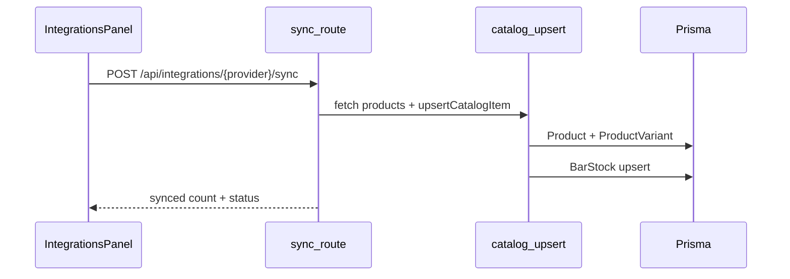

# Integraciones TPV, Shopify, Holded y Square

## Implementado

### TPV webhook

- Ruta: `POST /api/tpv/webhook`
- Archivo: [`app/api/tpv/webhook/route.ts`](../app/api/tpv/webhook/route.ts)
- Resuelve el bar por `x-tpv-provider` + `x-tpv-token` (o `body.tpv_token`)
- Verifica firma HMAC (`x-tpv-signature`) vía [`lib/tpv/verify-signature.ts`](../lib/tpv/verify-signature.ts)
- Proveedores parseados: `revo`, `lightspeed`, `square`
- Actualiza `BarStock` y evalúa reposición automática ([`lib/wholesale/reposition.ts`](../lib/wholesale/reposition.ts))
- URL expuesta en `/cuenta/integraciones` al guardar integraciones

### Shopify

- OAuth: `GET /api/integrations/shopify/oauth` → callback
- Sync manual: `POST /api/integrations/shopify/sync`
- Webhook: `POST /api/integrations/shopify/webhook` (HMAC, re-sync en eventos de producto)
- Lógica: [`lib/integrations/shopify.ts`](../lib/integrations/shopify.ts)
- Plugin Cursor / validación GraphQL: [`docs/SHOPIFY-PLUGIN.md`](./SHOPIFY-PLUGIN.md)
- Campos en `BarProfile`: `shopifyShopName`, `shopifyAccessToken`, `shopifySyncStatus`, etc.

### Holded (bidireccional)

- Sync manual: `POST /api/integrations/holded/sync`
- **Webhook entrada**: `POST /api/integrations/holded/webhook` — eventos `product.created`, `product.updated`, `product.deleted`, `stock.updated`
- **Push salida**: tras ventas TPV, actualiza stock en Holded vía API (`lib/integrations/holded-stock-push.ts`)
- Lógica: [`lib/integrations/holded-catalog.ts`](../lib/integrations/holded-catalog.ts), [`lib/integrations/holded-webhook.ts`](../lib/integrations/holded-webhook.ts)
- API key: `HOLDED_API_KEY` en servidor o `holdedApiKey` por bar en `BarProfile`
- Seguridad webhook: `HOLDED_WEBHOOK_SECRET` (env) o `holdedWebhookToken` del bar como fallback HMAC
- Cabeceras: `x-holded-signature`, `x-holded-bar-token` (token en `/cuenta/integraciones`)
- Importa productos Holded → `Product` + `ProductVariant` + `BarStock`
- Checkout/facturas: [`lib/holded.service.ts`](../lib/holded.service.ts); Stripe webhook → Holded con firma verificada

> Holded aún no publica webhooks nativos en producción (previsto 2026). El endpoint sirve para Zapier/Make o futura activación nativa.

### Square

- Sync manual: `POST /api/integrations/square/sync`
- Lógica: [`lib/integrations/square-catalog.ts`](../lib/integrations/square-catalog.ts)
- Token por bar: `squareAccessToken`, `squareLocationId` en `BarProfile`
- Entorno: `SQUARE_ENVIRONMENT=sandbox|production` (por defecto sandbox)
- Importa ítems del catálogo Square → `Product` + `ProductVariant`
- Resolución TPV: [`lib/integrations/resolve-variant.ts`](../lib/integrations/resolve-variant.ts) busca por SKU o `squareVariationId` en metadata

### Catálogo compartido

- Upsert reutilizable: [`lib/integrations/catalog-upsert.ts`](../lib/integrations/catalog-upsert.ts)
- Tras cada sync crea/actualiza `BarStock` para el bar conectado

### UI

- Panel unificado: [`components/account/IntegrationsPanel.tsx`](../components/account/IntegrationsPanel.tsx) en `/cuenta/integraciones`
- Conectar, reconfigurar y sincronizar Shopify, Holded y Square

## Variables de entorno

Ver [`.env.example`](../.env.example):

| Variable | Uso |
|----------|-----|
| `HOLDED_API_KEY` | API key global Holded (sync + checkout + push stock) |
| `HOLDED_WEBHOOK_SECRET` | HMAC del webhook de entrada Holded |
| `SQUARE_ENVIRONMENT` | `sandbox` o `production` |
| `SHOPIFY_CLIENT_ID` / `SHOPIFY_CLIENT_SECRET` | OAuth Shopify |
| `STRIPE_WEBHOOK_SECRET` | Verificación firma Stripe |
| `AI_RATE_LIMIT_*` | Rate limit del agente IA |

## Flujo de sincronización



## Pendiente / mejoras futuras

- OAuth Square y Holded (hoy: tokens manuales en UI)
- Webhooks nativos Holded cuando la API v2 los active en producción
- Cron de reconciliación Shopify (detectar drift catálogo)
- Redis para rate limit en despliegue multi-instancia

## Verificación local

```bash
npm run dev
npm run smoke
SMOKE_BASE_URL=http://localhost:3000 npm run test
```

## Documentación relacionada

- [docs/README.md](./README.md) — índice general
- [docs/ADMIN.md](./ADMIN.md) — panel mayorista y producción
- [AGENTS.md](../AGENTS.md) — guía para agentes IA
