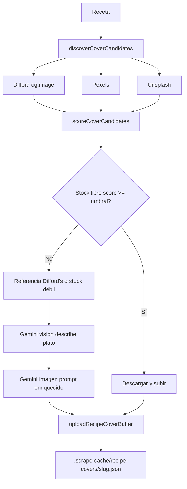

# Portadas de recetas (covers)

Pipeline **100% gratuito** para fotografías editoriales realistas: stock libre (Pexels/Unsplash), referencia Difford's solo para inspirar IA, y generación con **Gemini** (visión + Imagen 3).

No se usa stock de pago ni APIs de imagen de pago (OpenAI, etc.) en este flujo.

## Stack gratuito

| Capa | Servicio | Clave |
|------|----------|-------|
| Stock | [Pexels API](https://www.pexels.com/api/) | `PEXELS_API_KEY` |
| Stock | [Unsplash API](https://unsplash.com/developers) | `UNSPLASH_ACCESS_KEY` |
| Referencia | Difford's `og:image` (scrape interno) | — |
| Visión | Gemini Flash | `GEMINI_API_KEY` |
| Imagen IA | Gemini Imagen 3 | `GEMINI_API_KEY` |
| Fallback IA | HuggingFace SD 2.1 | `HUGGINGFACE_API_KEY` (calidad inferior) |

## Objetivo y criterios de calidad

Cada portada debe funcionar como **hero 4:5** en `/recetas/[slug]`, fichas Figma/Notion y catálogo.

Checklist fotográfico:

- Fotorealismo: cristal, condensación, líquido creíble según ingredientes
- Vaso correcto (nombre genérico en castellano, coherente con la receta)
- Garnish legible derivado de ingredientes (twist cítrico, cereza, aceituna…)
- Composición editorial: ángulo 3/4, macro 85mm, fondo bar oscuro, bokeh
- Marca El Travieso: acentos `#2B87B9`, `#F9D142`, `#A62125` en la luz — sin texto, logos ni caras

Referencias de marca: [`DISENO-MARCA.md`](./DISENO-MARCA.md) · prompts en [`lib/recipes/image-prompt.ts`](../lib/recipes/image-prompt.ts).

## Pipeline



### Prioridad de fuentes

| Orden | Fuente | Uso |
|-------|--------|-----|
| 1 | Pexels / Unsplash | Descarga directa si `score >= RECIPE_COVER_STOCK_MIN_SCORE` |
| 2 | Difford's `og:image` | **Solo referencia** para visión Gemini → prompt (no republicar el JPG) |
| 3 | Gemini Imagen | Prompt enriquecido con análisis de referencia o solo texto |
| 4 | HuggingFace | Fallback si falla Gemini (menor calidad) |

Si no hay stock suficiente, **siempre** se genera con IA gratuita; no hay cola de compra.

## Legal

- **Difford's:** inspiración visual para generación propia; no hotlink ni reutilización del asset original.
- **Pexels/Unsplash:** licencia gratuita; guardar atribución en manifest (`.scrape-cache/recipe-covers/{slug}.json`).

## CLI

```bash
# Piloto: ver candidatos y scores sin generar
npm run generate:recipe-images -- --discover-only --limit 10

# Generar con pipeline automático (stock → IA Gemini)
npm run generate:recipe-images -- --limit 5 --slug negroni

# Solo stock gratuito
npm run generate:recipe-images -- --strategy stock --limit 10

# Solo IA (ignora descarga stock)
npm run generate:recipe-images -- --strategy ai --slug sweet-martini

# Regenerar aunque ya tenga cover
npm run generate:recipe-images -- --force --slug negroni

# Importar archivo local descargado gratis (Pexels/Unsplash)
npm run generate:recipe-images -- --import-cover ./downloads/negroni.jpg --slug negroni

# Batch masivo (SVG/placeholder se procesan sin --force)
npm run generate:recipe-images -- --strategy stock --limit 50

# Segundo plano con log + estado (no hace falta supervisar)
npm run generate:recipe-images:bg -- --limit 50
npm run generate:recipe-images:status

# Equivalente manual
npm run generate:recipe-images -- --detach --batch --strategy stock --limit 50
```

### Batch en segundo plano

| Archivo | Contenido |
|---------|-----------|
| `.scrape-cache/recipe-covers/batch.log` | Log append-only con timestamp |
| `.scrape-cache/recipe-covers/batch-status.json` | Progreso, PID, último OK/error |

- `--detach` lanza el proceso en background (añade `--batch` automáticamente).
- `--batch` guarda `cocktails.json` tras **cada** portada OK (recuperable si se corta).
- Timeouts configurables (`.env.local`):

```bash
RECIPE_COVER_FETCH_TIMEOUT_MS=15000   # Pexels, Unsplash, descarga JPG
RECIPE_COVER_DIFFORDS_TIMEOUT_MS=20000 # scrape Difford's og:image
RECIPE_COVER_JOB_TIMEOUT_MS=90000     # timeout por receta (Promise.race)
```

Si una receta supera el timeout de job, se registra error y continúa con la siguiente.

## Admin

Panel `/admin/recipe-covers`: preview de candidatos desde manifest y botón «Usar esta foto» (stock Pexels/Unsplash).

Requisito previo: generar manifests con `--discover-only`.

## Mejoras de matching (Fase 1)

- **SVG no cuenta como portada real** — el batch procesa ~400 recetas con SVG/placeholder sin `--force` ([`lib/recipes/cover-utils.ts`](../lib/recipes/cover-utils.ts)).
- **Multi-query** — hasta 3 búsquedas Pexels/Unsplash por receta (título, espirituoso, vaso).
- **Scoring enriquecido** — bonus cocktail/spirit, penalización wine/beer; default umbral **0.50**.
- **Atribución** — campo `coverAttribution` en `cocktails.json` + caption bajo hero en ficha.

## Vision re-rank (Fase 2, opcional)

```bash
RECIPE_COVER_VISION_RANK=true
```

Re-puntúa top 3 candidatos stock con Gemini vision cuando el score heurístico está en zona gris (0.45–0.65).

## Variables de entorno

Añadir en `.env.local`:

```bash
# Mínimo recomendado
GEMINI_API_KEY=                    # https://aistudio.google.com/ — visión + Imagen 3
AI_IMAGE_PROVIDER=gemini

# Stock gratuito (al menos una)
PEXELS_API_KEY=                    # https://www.pexels.com/api/
UNSPLASH_ACCESS_KEY=               # https://unsplash.com/developers

# Umbral 0–1 para aceptar stock sin IA (default 0.72)
RECIPE_COVER_STOCK_MIN_SCORE=0.72

# Storage
SUPABASE_RECIPE_COVERS_BUCKET=recipe-covers
```

`AI_MOCK=true` genera SVG de marca sin llamar a APIs.

## Archivos clave

| Archivo | Rol |
|---------|-----|
| `scripts/generate-recipe-images.ts` | CLI batch |
| `lib/recipes/generate-recipe-image.ts` | Orquestador `resolveRecipeCover` |
| `lib/recipes/cover-discovery.ts` | Pexels, Unsplash, Difford's og:image |
| `lib/recipes/cover-reference.ts` | Scoring y umbral |
| `lib/recipes/cover-manifest.ts` | Manifest por slug |
| `lib/recipes/image-prompt.ts` | Prompts y garnish |
| `lib/ai/provider.ts` | `generateFreeImage`, `analyzeImageForRecipeCover` |
| `app/api/user/recipes/[id]/image/route.ts` | Regenerar desde cuenta |
| `lib/recipes/agent.ts` | Portada al crear receta con agente |

## Piloto recomendado

1. Configurar `GEMINI_API_KEY` + `PEXELS_API_KEY` y/o `UNSPLASH_ACCESS_KEY`.
2. `npm run generate:recipe-images -- --discover-only --limit 10`
3. Revisar scores; ajustar `RECIPE_COVER_STOCK_MIN_SCORE` si hace falta.
4. `npm run generate:recipe-images -- --limit 5`
5. Revisar en `/recetas/{slug}` y manifest en `.scrape-cache/recipe-covers/`.

## Tests

```bash
npm run test -- tests/recipe-cover-discovery.test.ts tests/recipe-image-prompt.test.ts
```
