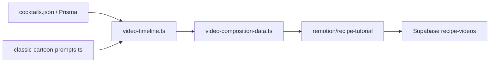

# Vídeos de recetas (Remotion + cartoon clásico)

Pipeline para mini-tutoriales **9:16 (~30–45 s)** con timeline por **beats**, mascota El Travieso y estética cartoon 60s–80s (inspiración de estilo, sin copiar IP protegida).

## Flujo



1. **Portada** (opcional pero recomendada): `npm run generate:recipe-images -- --slug <slug>`
2. **Descubrir beats + prompts**: `--discover-only`
3. **Render MP4**: sin flag extra (sube a Storage y actualiza `Recipe.videoUrl` si está en BD)

## Comandos CLI

```bash
# Validar timeline, cartoonMotion y cartoonPrompt por beat (sin render)
npm run render:recipe-videos -- --discover-only --slug sweet-martini

# Informe de cobertura (portada, vídeo, beats, gags, duración)
npm run render:recipe-videos -- --report --limit 20

# Refinar pasos con IA (requiere GEMINI_API_KEY, GROQ_API_KEY u otro proveedor)
npm run render:recipe-videos -- --polish --discover-only --slug sweet-martini

# Render obligando portada (hook + reveal)
npm run render:recipe-videos -- --slug sweet-martini --require-cover --force --limit 1

# Render directo con Remotion CLI (debug)
npx remotion render remotion/recipe-tutorial/index.ts RecipeTutorial out.mp4 \
  --props=.tmp-recipe-videos/sweet-martini-props.json
```

| Flag | Efecto |
|------|--------|
| `--discover-only` | JSON con beats, `cartoonMotion`, `cartoonPrompt` |
| `--report` | Tabla slug / cover / video / beats / gags / segundos |
| `--require-cover` | Solo recetas con portada real (no placeholder) |
| `--polish` | IA reescribe pasos (tono físico-cómico) antes del timeline |
| `--force` | Re-render aunque ya exista `videoUrl` |
| `--dry-run` | Lista targets sin render |
| `--slug` | Una receta concreta |
| `--limit N` | Máximo N recetas |

## Beats del timeline

Orden típico (sin portada se omiten `hook` y `reveal`):

| Beat | Duración (~fr) | Remotion |
|------|----------------|----------|
| `hook` | 90 | `HookScene` — Ken Burns portada |
| `brand_sting` | 70 | `BrandStingScene` — mascota + anticipación |
| `spec_card` | 120 | `SpecCardScene` — título + liquid tone |
| `ingredients` | 120–210 | `IngredientsBeatScene` — carousel |
| `technique` | 90 | `TechniqueBeatScene` — badge + gag físico |
| `step` × N | 100 c/u | `StepBeatScene` — paso + mascota |
| `reveal` | 120 | `RevealScene` — portada hero |
| `outro` | 90 | `OutroScene` — CTA |

Duración total = suma de `durationFrames` (30 fps). `RecipeTutorial` recibe `beats[]` y encadena `Sequence` por beat.

## Principios cartoon en Remotion

| Principio | Módulo |
|-----------|--------|
| Anticipación / squash | `motion/cartoon-timing.ts` → `AnimatedMascot` |
| Hold tras acción | `actionThenHold()` |
| Follow-through | `CartoonProp`, `followThroughOffset()` |
| Humor físico | `PhysicalGag` (`shaker_pop`, `splash`, `stumble`, `double_take`) |
| Fondo vermutería | `BarCartoonBackground` (3 capas parallax) |
| Entrada snappy | `spring({ damping: 12, stiffness: 200 })` |

## Biblioteca de prompts IA

Los prompts de fondos/personajes para herramientas externas (o futura gen IA) viven en:

- [`lib/animation/classic-cartoon-prompts.ts`](../lib/animation/classic-cartoon-prompts.ts) — Prompts 1–9 (Bloques A–E)
- [`docs/GUIA-REFERENCIA-ANIMACION.md`](./GUIA-REFERENCIA-ANIMACION.md) — Análisis + §5 integración

`buildCartoonBeatPrompt(beat)` selecciona el prompt según `kind`, `technique` y `gag`.

Ejemplo de uso en código:

```typescript
import { buildCartoonBeatPrompt } from "@/lib/animation/classic-cartoon-prompts";

const prompt = buildCartoonBeatPrompt({
  kind: "technique",
  technique: "shake",
  glass: "Copa martini",
  liquidTone: "deep amber-red vermouth tone",
});
```

## Archivos clave

| Recurso | Ruta |
|---------|------|
| Timeline | `lib/recipes/video-timeline.ts` |
| Prompts vídeo + motion | `lib/recipes/video-prompt.ts` |
| Props Remotion | `lib/recipes/video-composition-data.ts` |
| Prompts cartoon | `lib/animation/classic-cartoon-prompts.ts` |
| Composición | `remotion/recipe-tutorial/` |
| CLI | `scripts/render-recipe-videos.ts` |
| Mascota | `public/brand/travieso/mascot-*.svg` |
| Bucket | `SUPABASE_RECIPE_VIDEOS_BUCKET` (default `recipe-videos`) |

## Variables de entorno

- `SUPABASE_*` — subida del MP4 (ver `lib/storage/upload-image.ts`)
- `GEMINI_API_KEY` / `GROQ_API_KEY` — solo con `--polish`
- Sin Storage configurado: fallback local en `public/uploads/recipe-videos/`

## Restricciones legales

- Referencia *Daniel el Travieso* / DIC 80s = **principios de estilo** únicamente.
- **No** reproducir personajes, fondos ni diseños protegidos en prompts ni assets.
- Personaje en producción: mascota El Travieso (SVG propio).

## Documentación relacionada

- [GUIA-REFERENCIA-ANIMACION.md](./GUIA-REFERENCIA-ANIMACION.md) — §5 integración beat → prompt → motion
- [PORTADAS-RECETAS.md](./PORTADAS-RECETAS.md) — portadas para `hook` / `reveal`
- [DISENO-MARCA.md](./DISENO-MARCA.md) — tokens `#F9D142`, `#2B87B9`, `#A62125`
